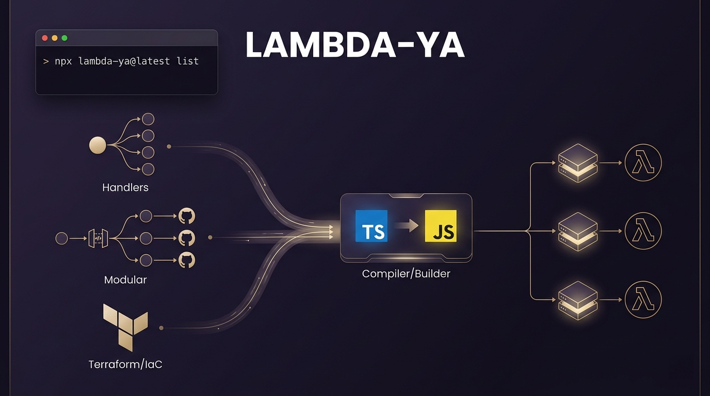

<h1 align="center">lambda-ya</h1>

<p align="center">
  <strong>用于从命令行生成 AWS Lambda TypeScript 项目的脚手架：提供 <code>handlers</code> 与 <code>modular</code> 两种布局；模板仅使用 AWS SDK for JavaScript v3，并可选择生成 <code>__iac__/</code> 下的 Terraform。</strong>
  <br />
  <em>配合 Cursor 等 AI 编程助手生成项目十分顺手。</em>
</p>

<p align="center">
  <a href="../README.md">English</a> |
  <a href="README.es.md">Español</a> |
  <a href="README.pt-BR.md">Português (Brasil)</a> |
  简体中文 |
  <a href="README.zh-TW.md">繁體中文</a> |
  <a href="README.ja.md">日本語</a> |
  <a href="README.ko.md">한국어</a>
</p>

<p align="center">
  <a href="#quick-start"></a>
  <a href="https://www.npmjs.com/package/lambda-ya"></a>
  <a href="../LICENSE.md"></a>
  <a href="https://github.com/b1labs/lambda-ya"></a>
  <a href="https://github.com/b1labs/lambda-ya/issues"></a>
  <a href="https://github.com/sponsors/crisd3v"></a>
</p>

<p align="center">
  
</p>

<p align="center">
  <small><a href="../CHANGELOG.md">变更日志</a>仅提供英文。</small>
</p>

---

## 环境要求

- **Node.js 18+**（推荐 20+）
- npm 9+

<a id="quick-start"></a>

## 快速开始

### 包发布后可执行

```bash
npx lambda-ya@latest list
npx lambda-ya@latest handlers my-service --yes --no-terraform
npx lambda-ya@latest modular my-api --yes --terraform --aws-profile=myprofile --aws-account-id=123456789012
```

### 全局安装

```bash
npm i -g lambda-ya
lambda-ya handlers my-service --yes --no-terraform
```

### 在本地克隆仓库后

```bash
node bin/lambda-ya.js handlers ./out/my-svc --yes --no-terraform
npm link   # 然后可直接运行 lambda-ya ...
```

## 命令

| 命令 | 说明 |
|------|------|
| `lambda-ya help` | 帮助 |
| `lambda-ya list` | 列出类型：`handlers`、`modular` |
| `lambda-ya <类型> <目录>` | 在指定目录生成脚手架 |
| `lambda-ya create <类型> <目录>` | 同上 |

常用参数：`--yes`、`--terraform` / `--no-terraform`、`--api-gateway=v1|v2`、`--aws-profile=`、`--aws-account-id=`、`--function-name=`、`--main-handler-file=`、`--main-handler-export=`、`--skip-install`。

## Terraform 与仅打包 zip

- **`--terraform`**：生成 `__iac__/` 与 `__iac__/bin/deploy.sh`。仅在此时复制与 Terraform/IAM 相关的 Cursor 命令与规则。
- **`--no-terraform`**：生成根目录 `bin/package-lambda.sh`（构建并生成 `lambda.zip`）。**不会**添加 Terraform 相关的 Cursor 命令。

## 贡献与发布

- 贡献指南（英文）：[CONTRIBUTING.md](../CONTRIBUTING.md)
- 发布：更新 `package.json` 版本与 [CHANGELOG.md](../CHANGELOG.md)，然后执行 `npm publish`。

## 许可证

ISC — 见 [LICENSE.md](../LICENSE.md) 与 [package.json](../package.json)。

## 资助

资助信息见 `package.json` 与 [.github/FUNDING.yml](../.github/FUNDING.yml)，请按实际情况修改链接。
